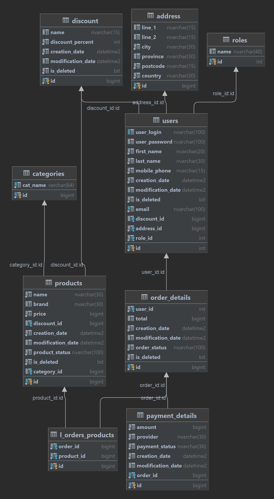

# laElectronics

Online electronics store application

Functionality
-------------------------
* Registration , Login (JWT)
* Search for a subscription
* View Profile and Update
* View Past orders
* Add a new subscription
* Calculating order cost
* Personal discounts for users and subscriptions

Technology
-------------------------
* Spring Boot, Security, Data Jpa 
* Angular, TypeScript, HTML, SCSS 
* Azure SQL Database
* Spring Doc OpenApi 3.0 for documentation
* Validation

Database diagram:
-------------------------
